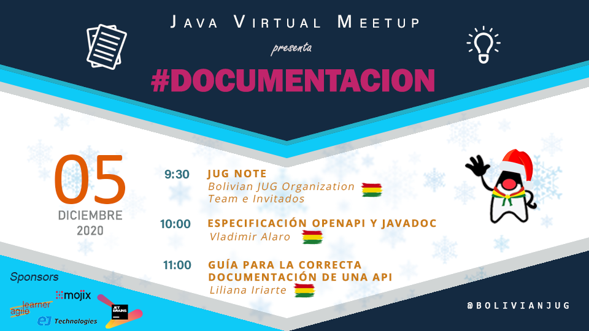
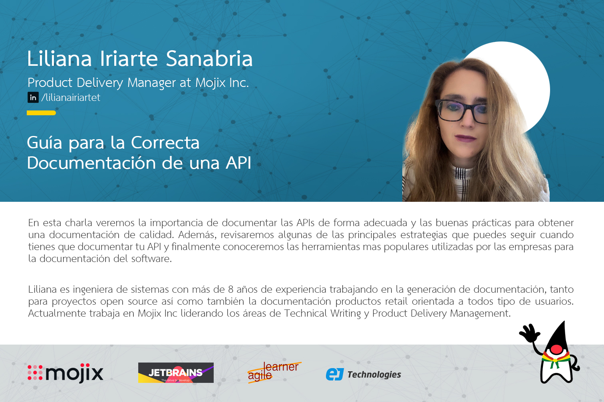
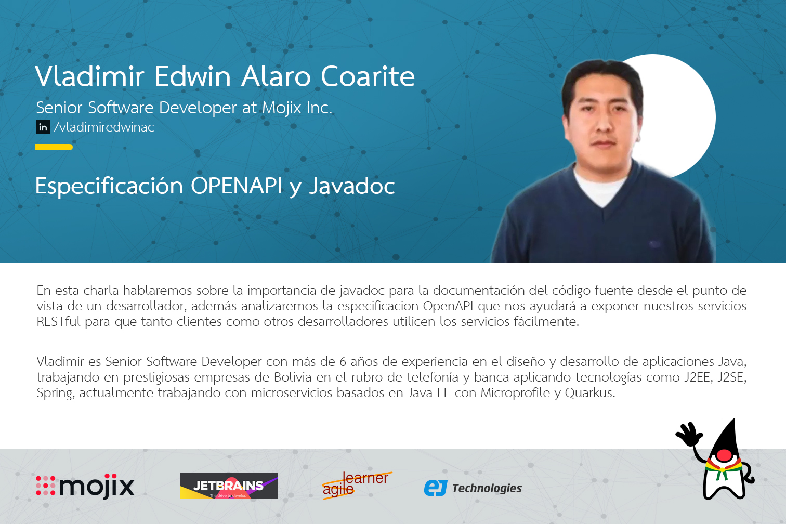

# Java Virtual Meetup ¿¡Y la documentación!?

Recursos del evento Java Virtual Meetup ¿¡Y la documentación!?

Videos:
- Jug Note: https://youtu.be/-Eke8kICi7Q
- Especificación OpenAPI y Javadocs: https://youtu.be/tXOIwjpM-W8
- Guía para la Correcta Documentación de una API:

Recursos:
- https://github.com/vladimiredwinac/demo-openapi 

Arte y Abstracts:

